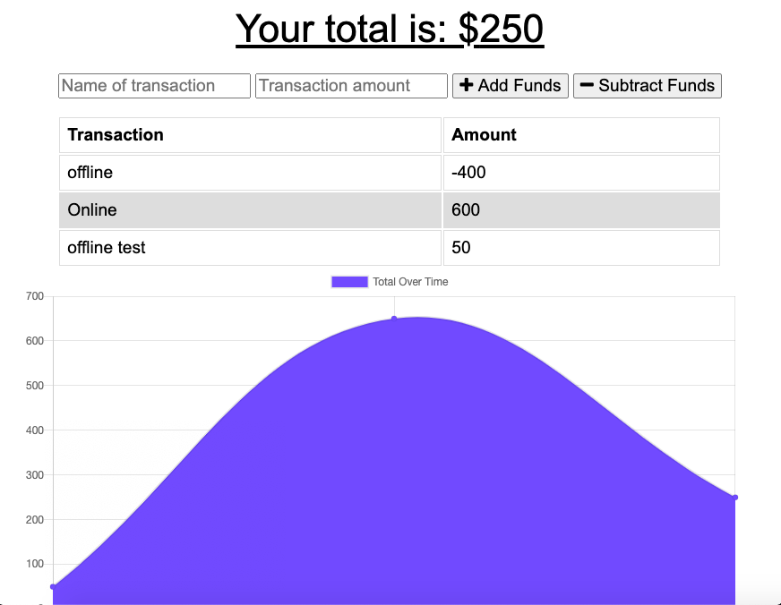

# Progressive Online/Offline Budget

# Description
This application allows the user to track their finances whether they have an internet connection or not. When the user is offline they can still use the app as they normally would, adding and subtracting funds, through data caching. When the user regains their internet connection the app will then take the cached data and save it to the database. 

# Technologies used
- HTML
- CSS
- JavaScript
- Express
- MongoDB
- Mongoose
- Compression
- Service worker
- Data Caching

# Links
GitHub Repository: https://github.com/ashtonwalden34/progressive-budget
Deployed application: https://offlineofflinetracker.herokuapp.com/

# Road Map
- Mobile responsive clean design
- Ability to change range of days being displayed